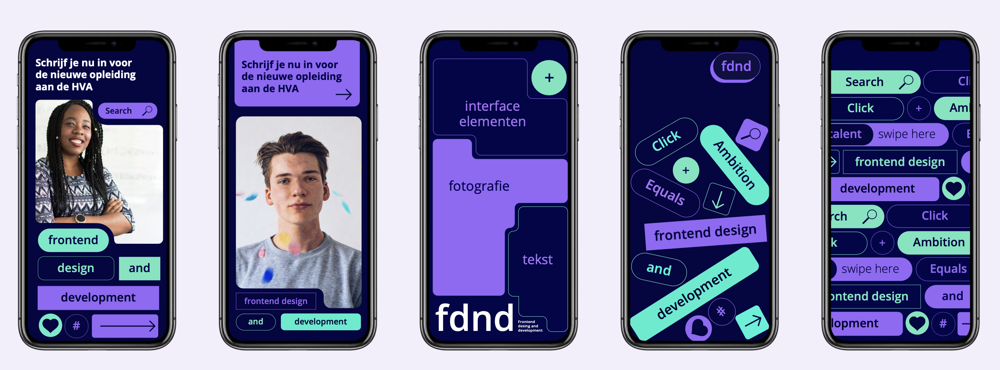
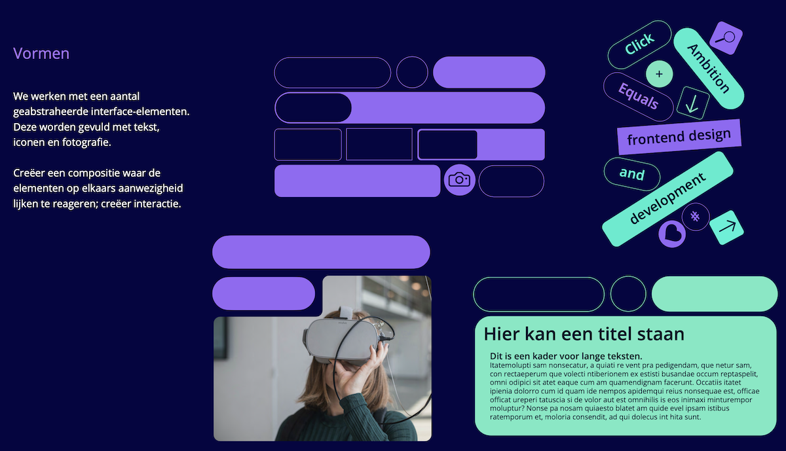
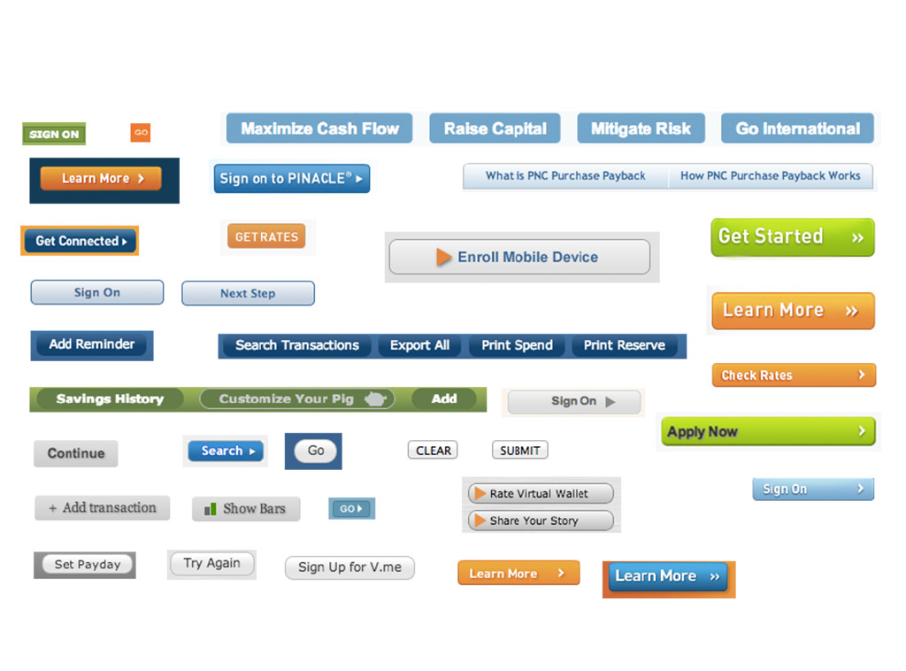

# Look and Feel - Corporate Identity

## Styleguide

Ontwerp en maak op basis van de huisstijl een *styleguide* voor een opdrachtgever.

<!-- 
DOEL: Die maandag wil je ze in Figma dingen laten doen toch?
Dat is/wordt de styleguide workshop 

Inventory
Template/sjabloon 'invullen' 
Dus als er iets niet is moet je dit zelf gaan bedenken en vormgeven

Styleguide: Figma file met onderdelen van componenten
De HTML voor de componenten, met CSS classes, custom props of anders...
Uiteindelijk: 1 stylesheet in een gezamenlijke repo die studenten met dezelfde opdrachtgever gebruiken in hun eigen project

Template in FIGMA voor de styleguide
8 artbooards en de bijhordende HTML klaarzetten in de leertaak. Styleguide.html. 
Studenten gaan zelf een stylesheet maken. 
Deze komt op 1 plek te staan

Maak een nieuwe page, noem deze "styleguide"
Maak/vul frame/artboard (form, typo, kleur, afbeeldingen, ....)
Daarbinnen components

-->

### Huisstijl

Een huisstijl is de visuele identiteit van een organisatie. Het symbolische gedeelte van de bedrijfsidentiteit.
Hieronder vallen naam, beeldmerk, kleuren, typografie (lettertype), vormentaal (stramienen/vlakken/curves/opmaak) en fotografiestijl.

*De huisstijl van FDND bestaat uit verschillende kleuren, vormen, typografie en gebruik van beeldmateriaal.*

Waarom heeft een bedrijf/instelling/organisatie een huisstijl nodig?
Het zorgt voor herkenbaarheid en het geeft de gebruiker een ervaring. Het laat zien wat de gebruiker/bezoeker kan verwachten. Als de visuele eigenschappen van een identiteit consistent worden vormgegeven, onstaat er vertrouwen bij de gebruiker.

### Huisstijlen toepassen met behulp van een Styleguide

Een frontender moet in staat zijn om een huisstijl goed toe te passen. Om dit te bereiken, moet je eerst een huisstijl analyseren: Wat zijn de eigenschappen van de huisstijl en hoe hebben ze vorm gekregen? Hoe gedragen deze eigenschappen zich? Wat is het idee erachter?

Een styleguide is essentieel voor het begrijpen en toepassen van een huisstijl. Een styleguide geeft voorbeelden en uitleg over hoe iets eruit moet zien. Een styleguide helpt bij het ontwerpen en bouwen van een website, zodat de verschillende elementen consistent worden toegepast.

*In de styleguide van FDND staat uitgelegd hoe de vormen en kleuren moeten worden toegepast.*

> Style guides are an important tool for web development today, especially in large, complex web applications. They help document styles and patterns, keep designers and developers in sync, and greatly help to organize and distill complex interfaces. ([Lambert, 2016](https://www.smashingmagazine.com/2016/05/creating-a-living-style-guide-case-study/))

## Aanpak

In de analysefase breng je in kaart hoe het zit met de huidige uitingen van de opdrachtgever en welke huisstijl onderdelen in gebruik zijn. Het resultaat is een *interface inventory*. 

Daarna gaan jullie de styleguide samenstellen door te bespreken hoe de huisstijl onderdelen er uit zien, en hoe ze in HTML en CSS gemaakt moeten worden.

### Interface inventory

Je begint met het in kaart brengen van alle onderdelen van de huisstijl en gemaakte websites. Het resultaat is een *interface inventory*, een verzameling van alle gemaakte interface elementen zoals typografie, images, media, buttons en andere formulier elementen.
 
 1. Julllie gaan met de studenten die dezelfde opdracht hebben de onderdelen van de huisstijl verzamelen in het Figma ontwerp. 
 2. Kopieer de artboards van de [Interface Inventory template](https://www.figma.com/design/Tox75iooqru0EvV3iLbkHw/Interface-Inventory?node-id=0-1&node-type=canvas&t=sZLKnogq564gwWdl-0) naar jullie Figma document. 
 3. Neem screenshots van alle huisstijl onderdelen die in gebruik zijn en verzamel ze in de juiste categorieën. Jullie voeren deze analyse uit op de oorspronkelijke huisstijl en alle gemaakte projecten voor de opdrachtgever, zodat jullie een goed beeld krijgen van de verschillende onderdelen die in gebruik zijn.
 4. Bespreek de interface inventory met een mentor.

*Voorbeeld van een Interface inventory van alle buttons die gebruikt worden op een bank website.*

<!--
#### interface inventory template

- Typography
    - Headings: headings, titels, subtitles, ...
    - Text elements: paragraphs, blockquotes, ...
    - Lists: bulleted, numbered, definition, ...
- Images
    - Logo's
    - Icons
    - Content images: different content images with borders, white space, ...
    - Image with captions
- Media
    - Video player
    - Audio player
    - Slideshow players
- Tables 
- Buttons
- Forms
    - Text inputs: text, email, url, password, ...
    - Select menu's
    - Radio/Checkbox Inputs
- Navigation
    - Primary Navigation
    - Tabs
    - Breadcrumbs
- Components
    - Carousels
    - Accordions
- ...
-->

## Styleguide samenstellen

1. Bespreek het verzamelde materiaal uit de _interface inventory_ en onderzoek of je overeenkomsten kunt ontdekken tussen de verschillende huisstijl onderdelen.
2. Ontwerp en maak voor alle huisstijl onderdelen een voorbeeld in HTML en CSS
    - Gebruik toegankelijke en semantische HTML, overleg met het team welke HTML elementen passend zijn
    - Definieer de CSS voor de huisstijl onderdelen, overleg met het team hoe jullie de CSS gaan coderen
    - Schrijf uitleg over hoe de huisstijl onderdelen wel en niet gebruikt mogen worden.
    - Toon de code van het onderdeel, zodat een frontender het voorbeeld makkelijk kan gebruiken
4. Verzamel alle onderdelen in een website, dit wordt jullie living styleguide voor de opdracht van de opdrachtgever.

https://github.com/fdnd-task/look-and-feel-styleguide

### Bronnen

- [What is a style guide and how to create one?](https://www.figma.com/resource-library/what-is-a-style-guide/)
- [Interface Inventory](https://bradfrost.com/blog/post/interface-inventory/)

Voorbeelden van een Styleguides:
- [Decathlon Design System](https://www.decathlon.design/726f8c765/p/75e137-digital-overview) 
- [Familysearch Styleguide](https://www.familysearch.org/frontier/styleguide/)

